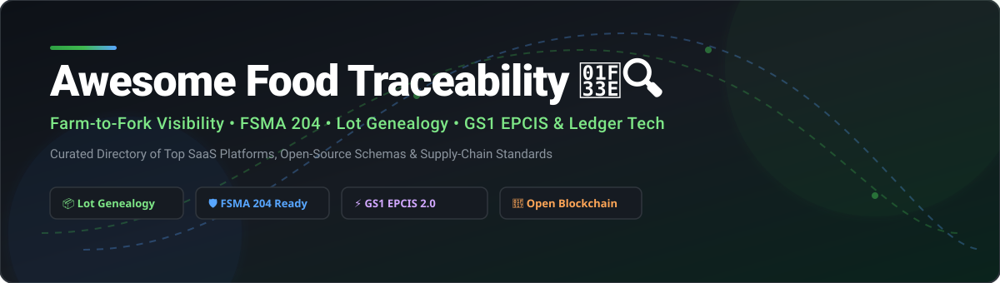

# Awesome Food Traceability 🌾🔍

  

  
  
  
  
  
  

> A curated list of production **SaaS platforms**, **open-source GitHub projects**, **GS1 EPCIS standards**, and **lot genealogy software** for end-to-end farm-to-fork food traceability, FSMA Section 204 regulatory compliance, recall readiness, and supply-chain transparency. 🚚📊

---

## 💡 Overview & Market Insights

The global **Food Traceability Market** is estimated at **$18.7B – $34.3B in 2025/2026** and projected to grow at a **CAGR of 5.6% – 9.4%** (with blockchain-based traceability segments growing at >30% CAGR). 

The sector is currently **moderately to highly fragmented**. While enterprise adoption is rapidly consolidating around GS1 EPCIS standards and FSMA 204 mandates, data silos remain common across multi-tier agricultural supply chains, creating significant opportunities for both commercial enterprise platforms and interoperable open-source standard libraries. 📈⚙️

---

## 📑 Table of Contents
- [🏢 SaaS & Hosted Enterprise Platforms](#-saas--hosted-enterprise-platforms)
- [🔓 Open-Source GitHub Projects](#-open-source-github-projects)
- [🤝 How to Contribute](#-how-to-contribute)
- [💖 Support & Sponsorship](#-support--sponsorship)
- [⚠️ Disclaimer](#%EF%B8%8F-disclaimer)
- [📈 Star History](#-star-history)

---

## 🏢 SaaS & Hosted Enterprise Platforms

| Platform | Enterprise Valuation / Size (Est.) | Pricing (Starting Tier) | Free Tier / Trial Limits | Core Traceability Focus & Compliance Capabilities |
| :--- | :--- | :--- | :--- | :--- |
| **[IBM Food Trust](https://www.ibm.com/products/food-trust)** | **~$120B+** (IBM Corp Market Cap) | ~$100 / month (Small Business tier) | 30-Day Free Trial (Full feature sandbox access) | Permissioned Hyperledger Fabric blockchain network enabling multi-party food supply chain visibility & data sharing. ⛓️ |
| **[TraceGains](https://www.tracegains.com/)** | **~$200M+** (Est. Private Valuation) | ~$20,000 / year (Enterprise Base) | Free Tier (Gather® Supplier Portal: store up to 100 documents free) | Supplier compliance, ingredient traceability network, automated document collection, and risk management. 📋 |
| **[FoodLogiQ / Trustwell](https://www.foodlogiq.com/)** | **~$150M+** (Est. Enterprise Value) | ~$5,000 / year (Standard Tier) | 14-Day Free Trial (Demo environment) | End-to-end CTE/KDE tracking, FSMA 204 compliance, automated recall management, and supplier verification. 🥑 |
| **[Safefood 360°](https://safefood360.com/)** | **~$100M+** (Ideagen Group Division) | ~$6,000 / year (Base Module Site license) | No Free Trial (Guided no-obligation live interactive demo) | Food safety & quality management platform with lot genealogy, HACCP compliance, and recall simulation. 🛡️ |
| **[ReposiTrak](https://repositrak.com/)** | **~$150M+** (Publicly Traded TRAK Market Cap) | ~$2,500 / year (Supplier Tier) | No Free Tier (Includes seller onboarding & setup support) | Food traceability network connecting retailers, wholesalers, and suppliers for FSMA 204 data exchange. 🏪 |
| **[Wherefour](https://wherefour.com/)** | **~$30M+** (Growth Phase Enterprise) | ~$600 / month (~$50/user/mo) | Demo Available (Custom Sandbox environment) | ERP and plant-floor lot tracking software for lot genealogy, inventory control, and food safety compliance. 🏭 |
| **[Parsyl](https://www.parsyl.com/)** | **~$50M+** (Venture Backed) | ~$300 / month (Hardware + Platform starter) | 30-Day Risk Pilot (Hardware sensor test kit) | Cold-chain monitoring and essential cargo risk management linked directly to temperature & quality data. 🌡️ |
| **[SafeTraces](https://www.safetraces.com/)** | **~$20M+** (AgTech Specialty) | ~$1,500 / month (Diagnostic program) | No Free Tier (Includes physical marker kit & testing validation) | On-food DNA-based physical barcodes and sanitation verification for origin & safety validation. 🧬 |

---

## 🔓 Open-Source GitHub Projects

Curated open-source projects, standard schemas, and tools for building custom food traceability ledgers, GS1 EPCIS standard data models, and IoT collectors.

*    **[Hyperledger Fabric](https://github.com/hyperledger/fabric)** - Enterprise-grade permissioned distributed ledger framework widely used as the underlying infrastructure for permissioned food traceability networks (e.g. IBM Food Trust). 🔗
*    **[Hyperledger Explorer](https://github.com/hyperledger-labs/blockchain-explorer)** - Open-source web application tool to view, query, and inspect blocks, transactions, and chaincode events in Hyperledger supply chain networks. 🔍
*    **[Blockchain Automation Framework](https://github.com/hyperledger-labs/blockchain-automation-framework)** - Production-ready Ansible & Kubernetes automation for deploying permissioned enterprise supply chain networks. 🚀
*    **[Hyperledger Fabric & React Supply Chain](https://github.com/kuldeep23907/Supply-Chain-using-Hyperledger-Fabric-and-React)** - Full-stack open-source reference implementation using Hyperledger Fabric and React for multi-tier product tracking. ⚛️
*    **[OpenEPCIS Event Hash Generator](https://github.com/openepcis/openepcis-event-hash-generator)** - Standard tool to generate unique algorithmic hashes for GS1 EPCIS 2.0 Critical Tracking Events (CTEs), vital for tamper-evident event linking. ⚡
*    **[OpenEPCIS Repository CE](https://github.com/openepcis/epcis-repository-ce)** - Community edition repository for capturing, storing, and querying GS1 EPCIS 2.0 event data models for supply-chain transparency. 📦
*    **[OpenEPCIS Standard Models](https://github.com/openepcis/openepcis-models)** - Open Java object models and JSON/XML schemas representing GS1 EPCIS & Core Business Vocabulary (CBV) data structures. 📄
*    **[OpenEPCIS Test Data Generator](https://github.com/openepcis/epcis-testdata-generator)** - Open-source tool to simulate complex multi-tier supply chain CTE/KDE event streams for testing and audit benchmarking. 🧪
*    **[INATrace](https://github.com/agstack/inatrace)** - Open-source digital traceability software for agricultural commodity supply chains (e.g. coffee, cocoa) developed under the Linux Foundation AgStack project. ☕

---

## 🤝 How to Contribute

Contributions are highly appreciated! Help keep this resource updated for developers, food safety auditors, and supply chain architects.

1. **Fork** this repository. 🍴
2. **Add/Edit** entries in `README.md` following our standard tabular/list formatting.
3. Ensure entries include product name, link, clear descriptions, pricing, or repository badges.
4. **Submit a Pull Request** with a clear explanation of your changes. 🚀

---

## 💖 Support & Sponsorship

If you find this curated list helpful for your research, company compliance, or engineering projects, please consider supporting the project:

- ⭐ **Star** this repository on GitHub to boost visibility!
- 🔀 **Fork** and share it with fellow software engineers & food safety professionals!
- ☕ **Buy me a coffee / Sponsor**: If you'd like to support ongoing open-source maintenance, check out the [GitHub Sponsor Dashboard](https://github.com/sponsors/ishandutta2007). 

Thank you for your encouragement and support! 🙏

---

## ⚠️ Disclaimer

- This list is **community-curated** for educational and informational purposes. It is not an official endorsement or financial advice.
- Food traceability systems directly impact food safety, consumer health, and regulatory compliance (e.g., US FDA FSMA 204). Software implementations should always be thoroughly validated by certified food safety professionals.

---

## 📈 Star History

